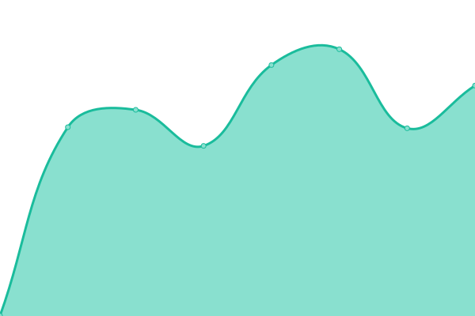
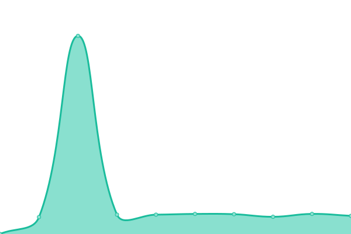

# [📈 Live Status](https://redjoker011.github.io/cg-upptime-monitoring): <!--live status--> **🟩 All systems operational**

This repository contains the open-source uptime monitor and status page for [Peter John Alvarado](https://redjoker011.github.io/cg-upptime-monitoring), powered by [Upptime](https://github.com/upptime/upptime).

With [Upptime](https://upptime.js.org), you can get your own unlimited and free uptime monitor and status page, powered entirely by a GitHub repository. We use [Issues](https://github.com/redjoker011/cg-upptime-monitoring/issues) as incident reports, [Actions](https://github.com/redjoker011/cg-upptime-monitoring/actions) as uptime monitors, and [Pages](https://redjoker011.github.io/cg-upptime-monitoring) for the status page.

<!--start: status pages-->
<!-- This summary is generated by Upptime (https://github.com/upptime/upptime) -->
<!-- Do not edit this manually, your changes will be overwritten -->
<!-- prettier-ignore -->
| URL | Status | History | Response Time | Uptime |
| --- | ------ | ------- | ------------- | ------ |
|  [ChatGenie CMS](https://www.chatgenie.ph) | 🟩 Up | [chat-genie-cms.yml](https://github.com/redjoker011/cg-upptime-monitoring/commits/HEAD/history/chat-genie-cms.yml) | 

 675ms
     
 | 

<a href="https://redjoker011.github.io/cg-upptime-monitoring/history/chat-genie-cms">100.00%</a>
    

|  ChatGenie Mini App | 🟩 Up | [chat-genie-mini-app.yml](https://github.com/redjoker011/cg-upptime-monitoring/commits/HEAD/history/chat-genie-mini-app.yml) | 

 1143ms
     
 | 

<a href="https://redjoker011.github.io/cg-upptime-monitoring/history/chat-genie-mini-app">100.00%</a>
    

|  ChatGenie API | 🟩 Up | [chat-genie-api.yml](https://github.com/redjoker011/cg-upptime-monitoring/commits/HEAD/history/chat-genie-api.yml) | 

 607ms
     
 | 

<a href="https://redjoker011.github.io/cg-upptime-monitoring/history/chat-genie-api">100.00%</a>
    

<!--end: status pages-->

[**Visit our status website →**](https://redjoker011.github.io/cg-upptime-monitoring)

## 📄 License

- Powered by: [Upptime](https://github.com/upptime/upptime)
- Code: [MIT](./LICENSE) © [Peter John Alvarado](https://redjoker011.github.io/cg-upptime-monitoring)
- Data in the `./history` directory: [Open Database License](https://opendatacommons.org/licenses/odbl/1-0/)
